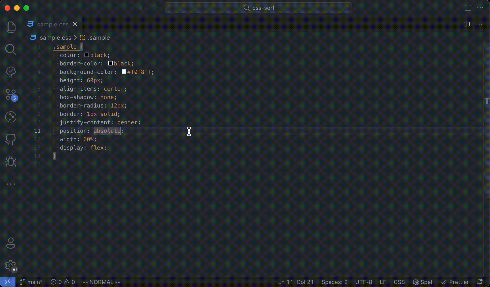
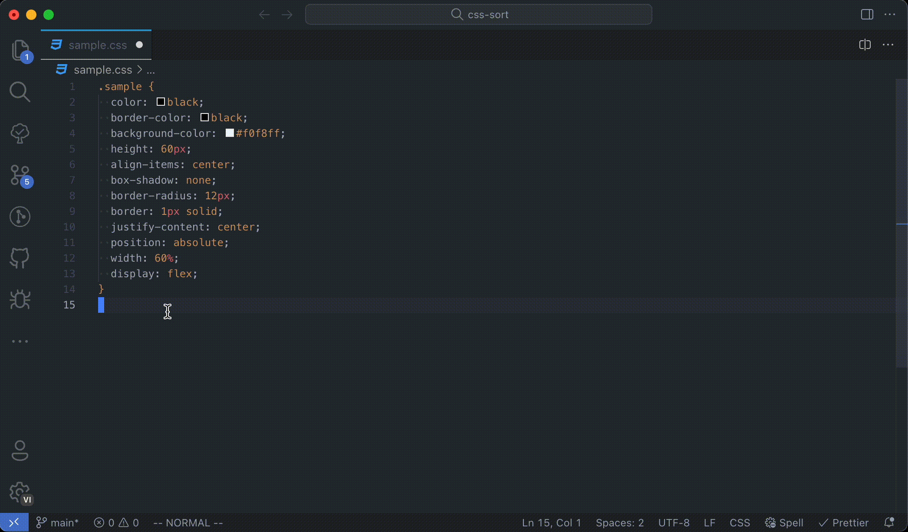
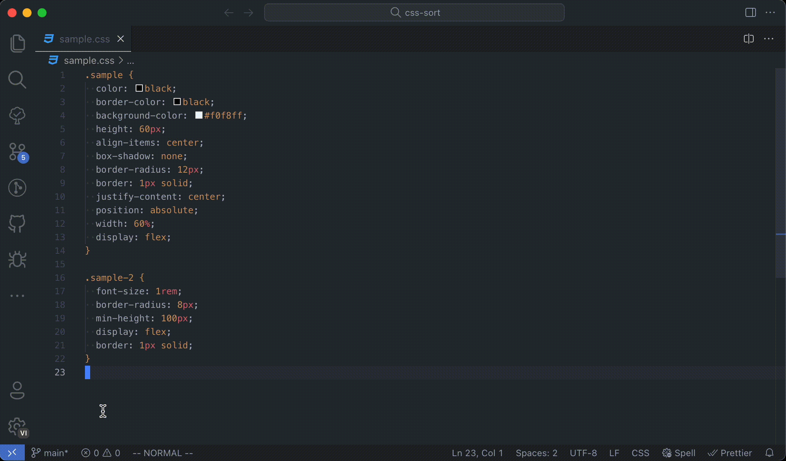

# Sort CSS

This extension allows you to sort css properties in your CSS, SCSS, LESS files, as well as inside `<style>` tags in HTML, Vue, Svelte and Astro files.

## Features

### Sort Using Shortcut

Shortcut on MacOs: `option` + `s` and on Windows/Linux: `alt` + `s`

### Sort Using Command Palette

### Sort On Save

This will sort the file whenever you save a css/scss/less file or any HTML/Vue/Svelte/Astro file containing style tags.

### Sort Selection

## Extension Settings

This extension contributes the following settings:

- `sortcss.sortOnSave`: Enable or disable sorting on save (default: `false`).
- `sortcss.sortingStrategy`: Choose sorting strategy from `concentric-css`, `alphabetical`, `smacss`, `frakto` or `manual` (default: `concentric-css`).
- `sortcss.ignoredFiles`: Ignore files or path. Example: `[ 'sample.css', 'src' ]`
- `sortcss.manualOrder`: Manual CSS sorting order. (set sortcss.sortingStrategy to `manual` to use this setting)

## Supported File Types

- CSS (.css)
- SCSS (.scss)
- LESS (.less)
- HTML (.html) - CSS within `<style>` tags
- Vue (.vue) - CSS within `<style>` tags
- Svelte (.svelte) - CSS within `<style>` tags
