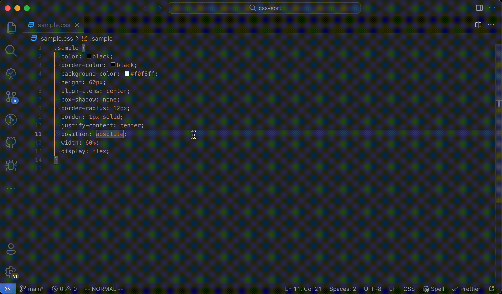
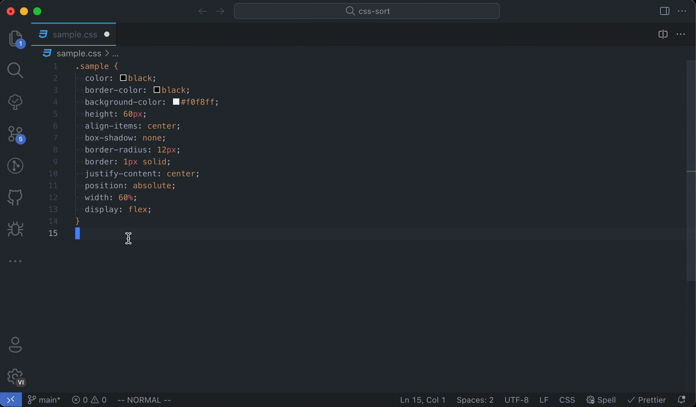
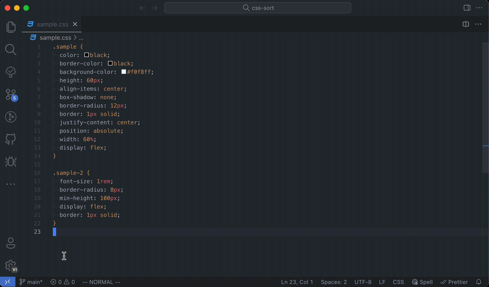

# Sort CSS

This extension allows you to sort css properties in your CSS, SCSS, LESS files, as well as inside `<style>` tags in HTML, Vue, Svelte and Astro files.

## Features

### Sort Using Shortcut

Shortcut on MacOs: `option` + `s` and on Windows/Linux: `alt` + `s`


### Sort Using Command Palette



### Sort On Save

This will sort the file whenever you save a css/scss/less file or any HTML/Vue/Svelte/Astro file containing style tags.


### Sort Selection



## Extension Settings

This extension contributes the following settings:

- `sortcss.sortOnSave`: Enable or disable sorting on save (default: `false`).
- `sortcss.sortingStrategy`: Choose sorting strategy from `concentric-css`, `alphabetical`, `smacss`, `frakto` or `manual` (default: `concentric-css`).
- `sortcss.ignoredFiles`: Ignore files or path. Example: `[ 'sample.css', 'src' ]`
- `sortcss.manualOrder`: Manual CSS sorting order. (set sortcss.sortingStrategy to `manual` to use this setting)

### Manual Ordering

Manual ordering lets you define exactly which CSS properties come first and in what sequence.

**1. Set the sorting strategy to `manual` in your VS Code settings (`settings.json`):**

```json
{
  "sortcss.sortingStrategy": "manual"
}
```

**2. Define your preferred property order using `sortcss.manualOrder`:**

```json
{
  "sortcss.sortingStrategy": "manual",
  "sortcss.manualOrder": [
    "position",
    "top",
    "right",
    "bottom",
    "left",
    "display",
    "width",
    "height",
    "background",
    "color",
    "font-size"
  ]
}
```

Properties listed in `sortcss.manualOrder` are sorted in the order they appear in the array. Any CSS properties **not** included in the list are appended after the explicitly ordered ones.

## Supported File Types

- CSS (.css)
- SCSS (.scss)
- LESS (.less)
- HTML (.html) - CSS within `<style>` tags
- Vue (.vue) - CSS within `<style>` tags
- Svelte (.svelte) - CSS within `<style>` tags
